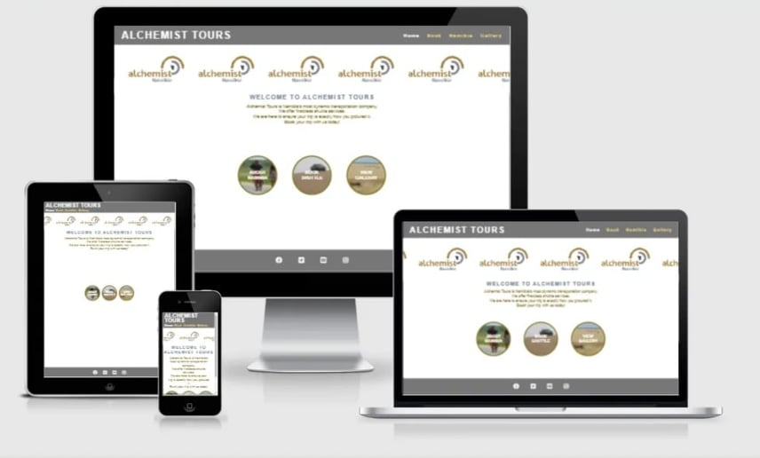
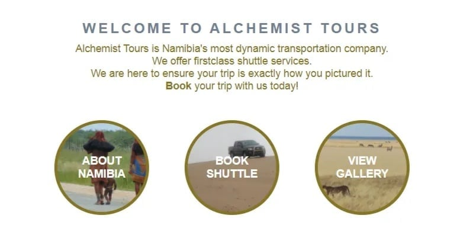
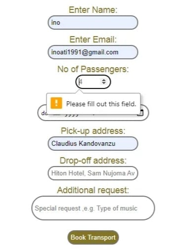
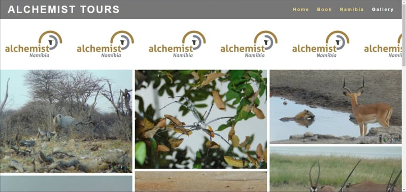
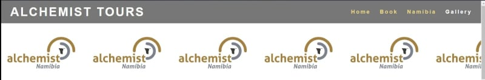
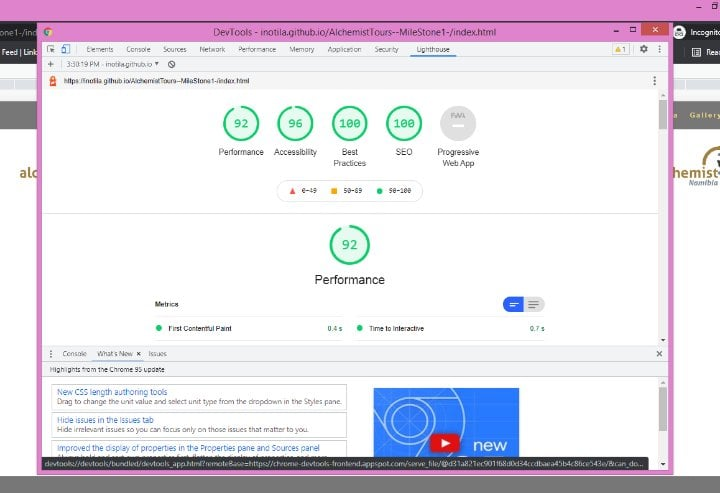

To run a frontend (HTML, CSS, JavaScript only) application in Gitpod, in the terminal, type:

python3 -m http.server

To run the webpage click on this link: <a href="https://inotila.github.io/AlchemistTours--MileStone1-/index.html ">Alchemist Tours</a>

# Alchemist Tours (Portfolio 1)

This project is for my final submission for my first milestone. The aim of the project is to code and deploy a static website using HTML and CSS. 

The last update to this file was: **October 27, 2021**

## About Alchemist Tours website

Alchemist Tours is a website for a company that offers shuttle services to and from Windhoek International airport as well as around the city of Windhoek. In order to market themselves they have created a website that lets people know about their services and also offer them an opportunity to book a shuttle online. In addition, the website also promotes travel to the country so as to grow the tourism industry. Users of the  website are people who will be traveling to Windhoek Namibia( the countries only international airport) and will be indeed of transport to or from the airport as it is 60kms away from the City and one cannot hitch a taxi from there. In addition, users are people considering traveling to Namibia and would like to know more about what the country has to offer.

The site owner, is a shuttle company. The company would like to make offer potential clients an opportunity to book their services online. Furthermore, provide market tourism in Namibia and provide reliable information about the country.

## Value

This site is for the conveniences of booking transport for tourist in and around the Windhoek. Furthermore, this site is provide prospective travellers with info about Namibia and give them a look (via the gallery) at what beauty’s Namibia has to offer. The website aims at marketing the country, so as to boost the tourism industry. 

For the owner, it add value by automating the booking of shuttles. Furthermore, it's a marketing tool for the company and tourism in Namibia as a whole. Here the owner will also be able to learn more about the wishes of prospective clients as the fill in the form. Most importantly, the owner has a platform for clients to book the companies services.

## Potential features (before starting)

1. A forum to book a shuttle to or from the airport.
2. A gallery with pictures and videos of Namibia.
3. A page with factual information about Namibia
4. A link to flight booking sites

## Actual Features (end product)
1. Welcome/home page -

Introduces the company and its services. In addition, it gives users the opportunity to navigate various to various pages on the website. This is opportunity is via the three circles. Users are alerted that the element is a link because if one hovers over them, the element expands to show its affordance.

The welcoming page is useful to the user because, it introduces the users to what the webpage is about and an indication of what can be done on the page. Furthermore, users can jump to other pages using the links.

2. Booking form - 

This is a form that allows users to book a shuttle. The form takes the details about the users name, their pickup/drop-off location and date, it also takes the number of passengers, and the users email. In addition there is a text field for additional request. While the text field is not required, the rest of the form inputs are required, therefor should be filled out. There is also a button to submit the form. The button has is responsive when hovered over, turning green when hovered over to indicate that is indeed a button.

The form is useful to the user because it’s an easy way to book a shuttle. It understandable, and does not take long to complete. In addition, users are given a chance to make additional request via the last text field before submitting.

3. About Namibia - 

A page that has information about Namibia. Users also have links to trip advisor and the gallery. These words are in bold to indicate that they are link. The trip advisor link opens on a new tab.

The about Namibia page is useful to the user because, here they can get basic info about Namibia if they are still deciding on whether they should travel to Namibia. In addition it links users to visual content (the gallery) and to other possible attractions in the country (trip advisor page).

4. Gallery -

 An organized gallery with various high quality images.

 The gallery is useful to the user, because of the visual content that shows users what to expect. In addition it is a great marketing tool for those who are scouting for a holiday destination.

5. Header (Navigation and logo) - 

A responsive navigation menu (top right corner) that indicates its current page by highlighting the current page with white text. Furthermore, when hovered over underlines the link so that users understand that the words is a link.

The navigation menu is useful to users because it shows users which page they are on by highlighting the active page. Furthermore, its and easy way to navigate the page. In general, it directs the user. It also shows the name/logo (top left corner) of the company, so users know which company owns the site.

6. Footer and social media links-

A footer to keep social media links and other ways to reach the company. These links are links that open in new tabs so as to not take the user away from the website.

The social media links are useful for the users because they encourage the user to get in contact with the company on other platforms (Facebook, Twitter, Instagram and YouTube). This gives them the ability to interact/contact the company and also research them more.

## Future Features
1. A link to flight booking sites
2. A live currency indicator using APIs
3. An indication of availability of shuttles.
4. The animated banner will be images from the gallery
5. Live embedded currency and weather indicators from APIs

## Testing
I tested if this page works in different browsers.

I ensured that the project is responsive, and the design looks good by using a minimalist approach. In addition I used the devtools to confirm that all devices maintain a good and structured design.

I ensured that the page is readable, and that it is easy to understand the page and the actions that are afforded to the user by links and buttons.

I have confirmed that all my inputs and fields work and accept the correct data format.

I have confirmed that all links work, and all images open.

I have confirmed that the navigation, header, booking, about Namibia and gallery are readable and understandable. 

## Bugs and fixes

### Solved bugs
I didn't come across too many bug. The bugs I came across where links that didn't work because I had a syntax error. Other common bugs were images not loading on other devices because my file path was wrong. I failed to include the (.) to indicate that it document was being loaded from the current file path.

While testing, I had feedback that the submit button lead participants to an error page. They didn't not enjoy this even if they were just testing. So to fix this I put the button into an anchor element that lead to an thank you page. However, this didn't work no matter what I tried. the error that kept showing up indicated that the form is a post and so command was not being accepted. So my solution was to change the form method from post to get. While this is not what the form is for, it improved the testing process.

I had issues with the navigation menu when the screen went lower than 950px and lower. It would not align properly on the right hand side, so to fix this I changed the float for element from float right to float left. This made it look better.

## Unfixed bugs

No unfixed bugs

## Validator testing

Html - No errors returned from the official w3c validator

CSS - No errors returned from the official (jigsaw) validator

Accessibility - Confirmation that the colors content is easy to read and the sight is accessible  by running it through lighthouse in devtools.

## Deployment

This project has been deployed on GitHub pages. The live link to project is: <a href="https://inotila.github.io/AlchemistTours--MileStone1-/index.html ">Alchemist Tours</a>
The steps to deploy this project are:

From the GitHub repository navigate to the settings option.

Select the Master Branch, from the source section.

And after selecting the Master Branch, provide the link to the website.

## Credits/Reference 
This work is the original work of Inotila Nghaamwa, however the following resources were used to supplement:

### Code
I used a similar code to the love running project for the footer social media links. And generally I used the coding practices I learnt during my course to create this project. <a href="https://learn.codeinstitute.net/dashboard">Code Institute</a> 

I researched from <a href="https://developer.mozilla.org/en-US/">Mozilla</a> to help me create this project. 

My friend Brav Regimus contributed to this project by advising me to use flex to fix my issue with having the footer not stick to the bottom.

I researched how to execute certain codes on <a href="https://stackoverflow.com/">stack overflow</a> to set up my banner to be animated. Furthermore, I used discussions on layouts to guide me to bettering my layout 

### Media

All images used are the property of Inotila Nghaamwa and are marked with a logo at the bottom right corner.

### Credits 

Content -
Text- Research by Inotila Nghaamwa from <a href="https://en.wikipedia.org/wiki/Namibia">Wikipedia/a>.

Images - All images used are the property of Inotila Nghaamwa and are marked with a logo at the bottom right corner.
